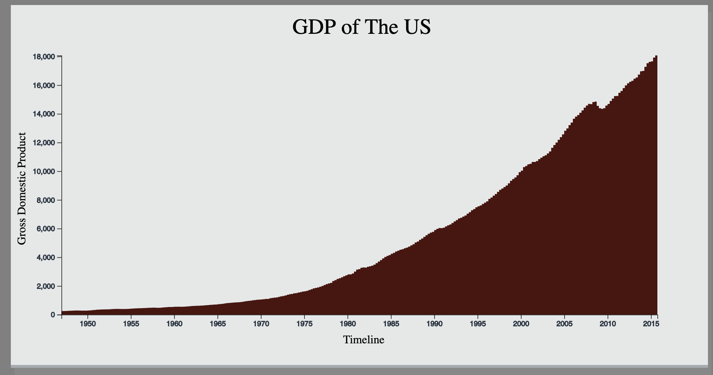

# D3-Data-Visualisation
This project visualises data with D3 using a bar chart. The data being displayed is the GDP of the US overtime. To preview a specific point in time, simply hover over the area.

This project was inspired and created for my freecodecamp data visualisation certificate.

[](https://codepen.io/ridwan098/pen/OJMrjGa)


# Live demo

You can view a live version [here](https://codepen.io/ridwan098/pen/OJMrjGa) or through this link: (will be redirected to)
```
> https://codepen.io/ridwan098/pen/OJMrjGa
```


## Links

- [My portfolio](https://ridwan.co.uk/)
- [By me a coffee](https://ko-fi.com/R1D1M1LL)